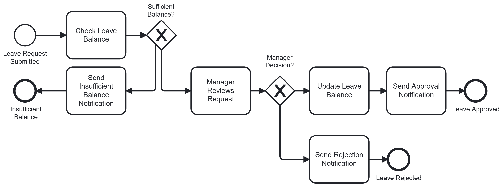
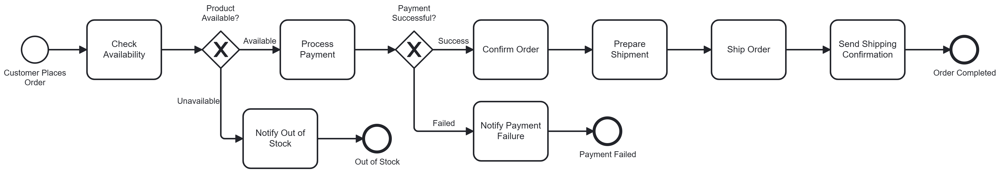
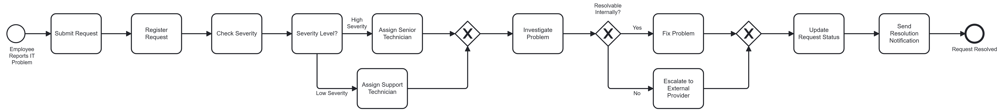

# Workflow Automation - Assignment 1

BPMN 2.0 process models for three organizational workflows, built in Camunda Modeler 5.49.

## Scenarios

### 1. Employee Leave Approval

Starts when an employee submits a leave request. The HR system checks the leave balance, then an exclusive gateway routes on the result. Insufficient balance sends a notification and ends. Sufficient balance routes to manager review, where a second gateway splits on the decision: approval updates the balance and notifies the employee, rejection sends a rejection notice. Three end events, one per outcome.

### 2. Online Purchase Order Processing

Starts when a customer places an order. Availability is checked first; unavailable products trigger an out-of-stock notice and end the process. Available products proceed to payment, where a second gateway splits on the payment result. Failure notifies the customer and ends. Success confirms the order, prepares the shipment, ships it, and sends a shipping confirmation.

### 3. IT Service Request

Starts when an employee reports an IT problem. The help desk registers the request and checks severity. Low severity routes to a support technician, high severity to a senior technician; both paths rejoin at a merging gateway before investigation. A second gateway splits on whether the issue is resolvable internally — either the technician fixes it or escalates to the external provider — and both paths rejoin before the status update and resolution notification.

## Files

| Scenario | Model | Diagram |
|---|---|---|
| Leave Approval | `scenario1-leave-approval.bpmn` | `images/scenario1-leave-approval.png` |
| Purchase Order | `scenario2-purchase-order.bpmn` | `images/scenario2-purchase-order.png` |
| IT Service Request | `scenario3-it-service-request.bpmn` | `images/scenario3-it-service-request.png` |

Open any `.bpmn` file in [Camunda Modeler](https://camunda.com/download/modeler/) v5.x or later.
